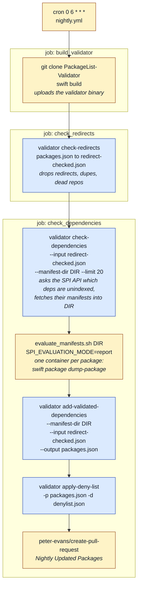

# spi-validator

Validator for nightly PackageList validation.

## How PackageList's nightly job uses this

The validator does not evaluate manifests, instead `check-dependencies` fetches candidate manifests and stops. Then these manifests should be evaluated with `swift package dump-package` in an isolated container. Finally, `add-validated-dependencies` adds whichever ones loaded.

That split is why the dependency check is three commands rather than one. PackageList and PackageList-Validator agree on a directory layout for the manifests.



Blue is this repository, amber is PackageList.

### The handover directory

`--manifest-dir` is the interface between the two repositories.

```
DIR/
├── evaluated                     written by the script once it has run
├── <owner>_<repo>/
│   ├── manifests/Package*.swift  the only thing mounted into the container
│   ├── url                       which package these came from
│   └── failed                    written by the script if they did not load
└── ...
```

### Running it by hand

`check-dependencies` needs an `SPI_API_TOKEN` and a `GITHUB_TOKEN`; the evaluation step needs docker and a `SWIFT_IMAGE`.

```sh
mkdir -p /tmp/manifests

validator check-dependencies --spi-api-token "$SPI_API_TOKEN" \
    --input packages.json --manifest-dir /tmp/manifests --limit 3

SWIFT_IMAGE=swift:6.3-jammy SPI_EVALUATION_MODE=report \
    bash ../PackageList/.github/evaluate_manifests.sh /tmp/manifests

validator add-validated-dependencies --manifest-dir /tmp/manifests \
    --input packages.json --output /tmp/packages.json
```

## Prepare new release

- Run `make commit` (if there have been any code level changes)
- Push
- Merge to `main` for it to be picked up
